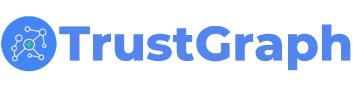

<div align="center">



[**Website**](https://trustgraph.ai) | [**Docs**](https://docs.trustgraph.ai) | [**YouTube**](https://www.youtube.com/@TrustGraphAI?sub_confirmation=1) | [**Launch TrustGraph**](https://config-ui.demo.trustgraph.ai/) | [**Discord**](https://discord.gg/sQMwkRz5GX) | [**Blog**](https://blog.trustgraph.ai/subscribe)

# The Context Interoperability Layer for Agentic AI

</div>

[TrustGraph](https://trustgraph.ai) is an open-source context interoperability layer designed to power the next generation of enterprise AI.

AI applications fail without shared context. LLMs are powerful, but without a structured, unified context layer — one that bridges silos, captures complex relationships, and enforces governance — agents hallucinate, violate policies, and produce non-deterministic outcomes.

TrustGraph builds that layer. It uses hypergraphs to turn raw enterprise data into AI-ready context: a unified semantic context layer where agentic outcomes are deterministic and agent behavior is not just traceable, but cryptographically verifiable.

## The Problem: "Common Context Understanding"
To understand why AI struggles in the enterprise, consider Abbott and Costello’s classic ["Who's on First?"](https://www.youtube.com/watch?v=sYOUFGfK4bU) routine.

Abbott explains the baseball lineup: `Who` is on first base, `What` is on second base, and `I Don't Know` is on third base. Costello is driven mad because he assumes Abbott is asking questions rather than stating the names of the players: `Who`, `What`, and `I Don't Know`.

Two agents cannot communicate if they do not share the same context understanding.

## Why Vector Embeddings and Semantic Search Fail Here
If you feed this scenario into a standard RAG pipeline using vector embeddings and semantic similarity, it breaks completely.

If a user asks: "*Who is playing on first base?*"

1. The vector database converts the query into an embedding.
2. Semantic similarity searches for vectors close to "playing," "first base," and "who."
3. Because "Who" is a common pronoun, the embedding space maps it to general inquiries about identity, not the specific name of a baseball player.
4. The LLM retrieves irrelevant documents and hallucinates, failing to understand that "Who" is an entity (a Person), not a question.

Semantic similarity operates on fuzzy, statistical probability. It cannot distinguish between the linguistic usage of a word as a pronoun and its usage as a proper noun within a specific, localized context.

## Why HyperGraphs Solve Context
A HyperGraph, specifically built using standards like RDF and OWL, establishes explicit, unambiguous semantics. It doesn't rely on "guessing" based on word proximity; it relies on defined relationships.

Here is the "Who's on First" routine modeled in RDF/OWL. By structuring data this way, the LLM knows exactly what "Who" means in this context:

```turtle
@prefix : <http://trustgraph.ai/baseball#> .
@prefix rdf: <http://www.w3.org/1999/02/22-rdf-syntax-ns#> .
@prefix rdfs: <http://www.w3.org/2000/01/rdf-schema#> .
@prefix owl: <http://www.w3.org/2002/07/owl#> .

# Ontology Classes
:Player a owl:Class ;
    rdfs:subClassOf owl:Thing .

:BaseballPosition a owl:Class .

# Object Properties
:playsPosition a owl:ObjectProperty ;
    rdfs:domain :Player ;
    rdfs:range :BaseballPosition .

# Data (The Context)
:Who a :Player ;
    rdfs:label "Who" .

:What a :Player ;
    rdfs:label "What" .

:IDontKnow a :Player ;
    rdfs:label "I Don't Know" .

:FirstBase a :BaseballPosition ;
    rdfs:label "First Base" .

:SecondBase a :BaseballPosition ;
    rdfs:label "Second Base" .

:ThirdBase a :BaseballPosition ;
    rdfs:label "Third Base" .

# The Explicit Relationships
:Who :playsPosition :FirstBase .
:What :playsPosition :SecondBase .
:IDontKnow :playsPosition :ThirdBase .
```

When an agent queries a TrustGraph hypergraph, it uses SPARQL or GraphRAG to traverse these explicit paths. The agent knows that `:Who` is a `:Player` whose `:playsPosition` is `:FirstBase`. Hallucination is eliminated because context is structured, not inferred via probability.

## Going Beyond Traditional Graphs: The Hypergraph
Standard Knowledge Graphs (KGs) are limited to binary relationships (Node A → Node B). Enterprise context is rarely this simple.

TrustGraph leverages [RDF 1.2](https://www.w3.org/TR/rdf12-concepts/) and [Named Graphs](https://en.wikipedia.org/wiki/Named_graph) as [N-Quads](https://en.wikipedia.org/wiki/N-Triples#N-Quads) to achieve a cutting-edge hypergraph architecture. RDF 1.2 introduces the ability to reference entire statements (triples) as nodes themselves. Combining RDF 1.2 with Named Graphs enbables grouping complex, multi-entity events into a single, addressable conceptual unit for true n-ary relationships.

- Standard Knowledge Graph: `Document` → `Author`
- TrustGraph Hypergraph: Connects `Document`, `Author`, `Approving Manager`, `Compliance Policy`, and `Time/Location` Metadata into a single, complex relational event.

This hyper-relational context is what enables autonomous agents to reason through complex enterprise workflows and governance policies.

## Core Capabilities of the Interoperability Layer
TrustGraph provides the infrastructure to convert raw data into agentic context and manage it at scale.

1. Raw Data to AI-Ready Context
TrustGraph isn't just a graph database; it is a processing engine. It ingests unstructured, raw enterprise data (PDFs, wikis, APIs, databases), extracts entities and relationships using LLMs, and structures them directly into the hypergraph—transforming chaotic data into AI-ready context.

2. Hyperflows: Custom Agents and Workloads
Hyperflows are unique agentic workflows where processing capabilities are chained together. Developers can configure specific LLMs and specific Context Graph access permissions for every step of a workflow. A Hyperflow can route a query from a lightweight local model for classification, to a heavy reasoning model, drawing from different hypergraph collections at each step based on governance rules.

3. Context Management: Workspaces, Collections, and Context Cores
Managing enterprise context requires strict orchestration. TrustGraph provides purpose-built context management features:

- Workspaces: Deep, programmatic data isolation for users, agents, and hyperflows. Ensure that an HR agent cannot read financial data, and multi-tenant data remains strictly compartmentalized.
- Collections: Enterprise knowledge bases aren't just flat files. Manage, partition, and query distinct knowledge bases directly within the hypergraph. Dynamically combine a "Product Specs" collection and a "Support Tickets" collection in real-time for an agent.
- Context Cores: Modular, portable, and reusable units of context. Package domain-specific knowledge into a Context Core and plug it into any agent or workflow. It’s context-as-a-service.

## Agentic Platform Features
Beyond the hypergraph and context management, TrustGraph is built to provide the full agentic stack for enterprise AI.

- Provenance (Real-Time Traceability): TrustGraph captures all event metadata in the hypergraph, providing real-time traceability for every decision an agent makes. If an agent takes an action, you can trace the exact path through the hypergraph that led to that outcome—solving the "black box" problem for enterprise compliance.
- Open LLM Inference Stack: Don't lock your enterprise data behind proprietary API paywalls. TrustGraph includes a built-in LLM inference stack capable of running open-source models on any hardware (Nvidia, AMD, or Intel accelerators), keeping your data and compute entirely within your sovereignty.
- Deployment Flexibility: Enterprise requirements dictate where data lives. TrustGraph can be totally self-hosted (air-gapped on-premise), deployed as Bring-Your-Own-Cloud (BYOC) into your existing VPC, or consumed as a fully managed SaaS.

## TrustGraph vs. Standard Enterprise Context Search

| Capability | Standard Enterprise Search (e.g., Glean) | TrustGraph |
| :--- | :--- | :--- |
| **Core Architecture** | Search indexing over documents/connectors | **Context Interoperability Layer** via Hypergraph |
| **Context Depth** | Document retrieval & vector similarity | **Hyper-relational Context**: N-ary relationships capturing true enterprise events |
| **Context Management** | Basic RBAC tied to SSO | **Workspaces, Collections, & Cores**: Modular, isolated, reusable context units |
| **Agent Orchestration** | Basic Q&A or simple LLM chains | **Hyperflows**: Complex, chained agentic workflows with step-level LLM and graph config |
| **Traceability** | Logs of search queries | **Provenance**: Real-time hypergraph traceability for all agent reasoning |
| **Compute** | API calls to proprietary LLMs | **Open LLM Stack**: Runs open models natively on Nvidia, AMD, or Intel hardware |
| **Deployment** | SaaS only | **Flexible**: Self-hosted, BYOC, or SaaS |
     
## No API Keys Required

How many times have you cloned a repo and opened the `.env.example` to see the dozens of API keys for 3rd party dependencies needed to make the services work? There are only 3 things in TrustGraph that might need an API key:

- 3rd party LLM services like Anthropic, Cohere, Gemini, Mistral, OpenAI, etc.
- 3rd party OCR like Mistral OCR
- The API key *you set* for the TrustGraph API gateway

Everything else is included.
- [x] Managed Multi-model storage in [Cassandra](https://cassandra.apache.org/_/index.html)
- [x] Managed Vector embedding storage in [Qdrant](https://github.com/qdrant/qdrant)
- [x] Managed File and Object storage in [Garage](https://github.com/deuxfleurs-org/garage) (S3 compatible)
- [x] Managed High-speed Pub/Sub messaging fabric with [Pulsar](https://github.com/apache/pulsar) or [RabbitMQ](https://www.rabbitmq.com/)
- [x] Complete LLM inferencing stack for open LLMs with [vLLM](https://github.com/vllm-project/vllm), [TGI](https://github.com/huggingface/text-generation-inference), [Ollama](https://github.com/ollama/ollama), [LM Studio](https://github.com/lmstudio-ai), and [Llamafiles](https://github.com/mozilla-ai/llamafile) 

## Support & Community

- **Have Questions?** [Join our Discord](https://discord.gg/sQMwkRz5GX)
- **Found a Bug?** [Open an issue](https://github.com/trustgraph-ai/trustgraph/issues)
- **Need Help?** [Check the documentation](https://docs.trustgraph.ai)
- **Ready to Contribute?** [See the contributing guide](CONTRIBUTING.md)
